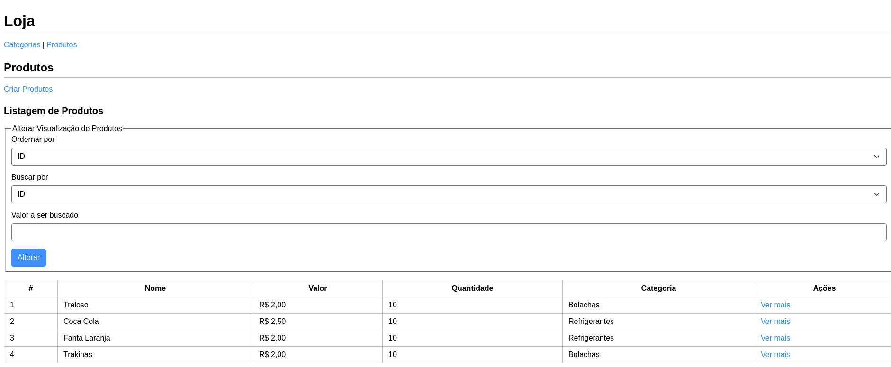
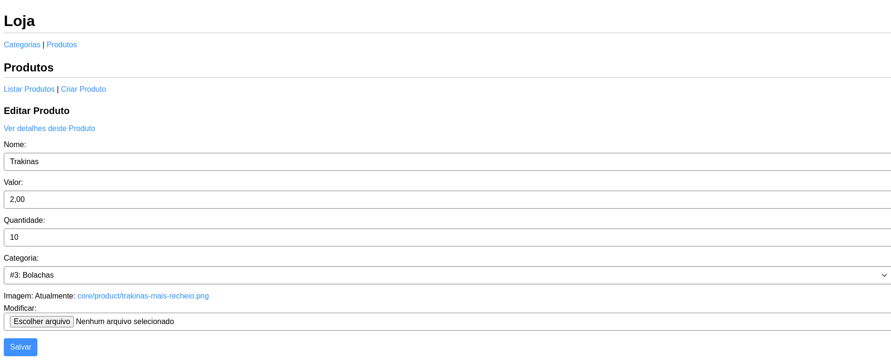

# 🏬 Loja em Django

Desafio do Workshop de Backend para Fábrica de Software no semetre 2021.1

## 🖼️ Algumas Telas





## ⚙️ Comandos no terminal

**pré-requisitos para o pyenv no ubuntu**

```
sudo apt-get install -y build-essential libssl-dev zlib1g-dev libbz2-dev \
libreadline-dev libsqlite3-dev wget curl llvm libncurses5-dev libncursesw5-dev \
xz-utils tk-dev libffi-dev liblzma-dev python-openssl git
```

**instalação do pyenv**

```
curl https://pyenv.run | bash
```
**instalação do python**

```
python install 3.9.2
python global 3.9.2
```

**clone do repositório e mudança de diretório para o mesmo**

```
git clone https://github.com/inolopesm/desafio-workshop-fds-2021-1
cd desafio-workshop-fds-2021-1
```

**criação do ambiente python virtualizado e ativação do mesmo**

```
python -m venv venv
source venv/bin/activate
```

**criação das tabelas no banco de dados sqlite**

```
python manage.py migrate
```

**inicialização do projeto em modo de desenvolvimento**

```
python manage.py runserver
```

## ✏️ Anotações e considerações

Foi um CRUD simples com um relacionamento um-pra-muitos de produtos e categorias, com o uso do django. O django facilita muita coisa mas você tem que estar atento a documentação para saber o jeito django de fazer o que você quer.

Se alguém estiver vendo este projeto e quiser implementar mais alguma coisa, recomendo adicionar a funcionalidade de venda, onde baixará o estoque do(s) produto(s)
